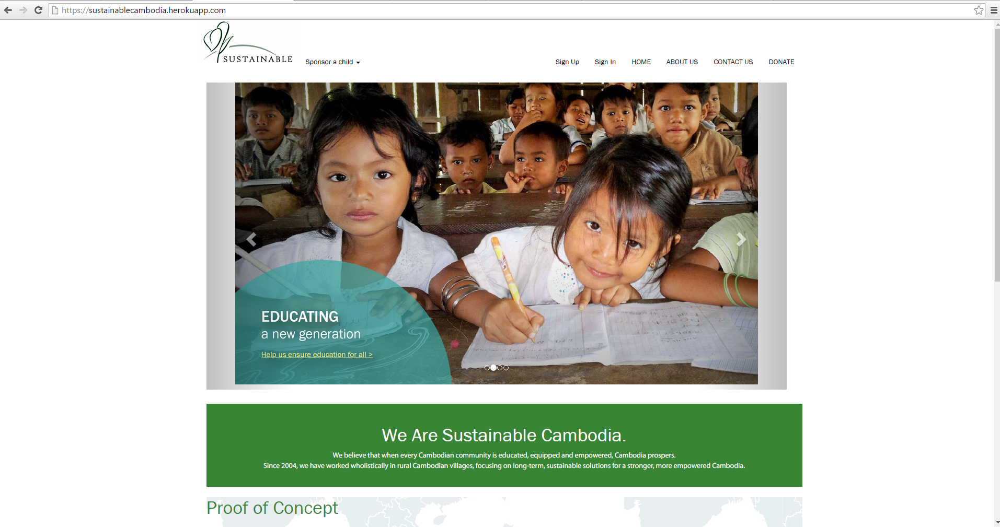




# Sustainable Cambodia Github - Team 2A


## Sustainable Cambodia web application is deployed at:

>[https://sustainablecambodia.herokuapp.com/](https://sustainablecambodia.herokuapp.com/)

## Sustainable Cambodia github:
>[https://github.com/2aIsTheWay/Sustainable_Cambodia.git](https://github.com/2aIsTheWay/Sustainable_Cambodia.git)

### Thanks to the following resources for code -
* Yeoman generated Mean stack
* Bootstrap
* Angular UI Grid

###List of All Project Features:
* Administrative Dashboard
* Can view sponsorships, children, and donations at a high level
* Landing Page
* Complete with Carousel and proof of concepts
* Implemented Child Module
* Lists all eligible children (even ineligible if admin)
* Create children
* Remove Children
* Edit children (both photo and information)
* Implemented Sponsorships Module
* Ability to create a sponsorship for a child that will then update the child’s funding level
* Can view user sponsorships made
* Makes use of pre built MEAN user module but slightly edited for Sustainable Cambodia’s purposes
* Implemented role based restrictions for features of the website

### List of All Incomplete Features:
* All incomplete features and bugs are located on the github in the issues section of the repository
* Instructions for how to run the project locally:
* Install git for the ability to use git commands in the terminal
* Install node.js and node pack manager (npm)
* using the following link - Download & Install Node.js
* Download and Install Ruby
* using the following link -Download & Install Ruby
* Run a terminal that supports git functionality
* Download bower through the terminal by running ```npm install -g bower```


Clone the repository into a file of your choosing
Navigate to the local repository
Run an ```npm install``` in the shell to install all dependencies
Navigate to ```./config/env``` and find the file titled local example
Insert your MongoLab uri into the local example file and rename it local.js (Use URI with a username and password in it)
Once done, type ```grunt``` in terminal and then, once it is done loading and running, navigate to ```localhost:3000``` in your browser.
The site should navigate to the homepage and look like this



If you want to locally display and add children photos, add a file called uploads that has all old children images  in it to the module/client/img folder. 
After that make sure that all html ng-src file paths point to ./modules/children/client/img/uploads/{{variable storing file name}}
so that they will be displayed in the html (note all uploaded images save to this path).

For more info on running a local instance of a mean stack see READMEMEAN.md in this repo

## How to update database and server connections:
1. To get started you want your own database. For the purpose of this project and testing you would want create your own MLab account
2. Go to the MLab website
3. Create an account if you don’t have one
4. Create a new database (whatever tier that you want and are willing to pay for)
5. In that database, create a new user with all abilities to modify the database.
6. Then take the uri that is given for the user you just created and paste the full uri given into the local example/ local.js
7. This gives your site the ability to function with this new db that you created and will create appropriate collections when the time comes
8. Later you will want a cloud to update pictures to rather than storing them locally
9. To do this you would need to create a server to host all the images
10. Know the URL to access the images and insert this url whenever you want to load a picture in the html
11. Find a file upload dependency to add to the stack such as multiparty
12. Improve the angular controller to pass over the file to be uploaded to the server side
13. Use the new file upload dependency to add the requested file to the server hosting the images by utilizing the dependency in the server functions changePrimaryPhoto and changeprofilePicture in the children and user modules respectively.
